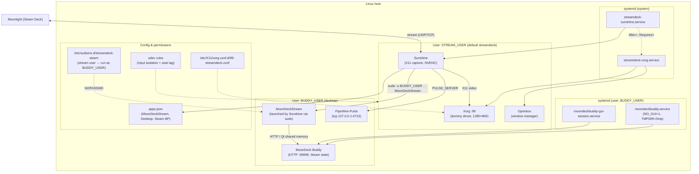
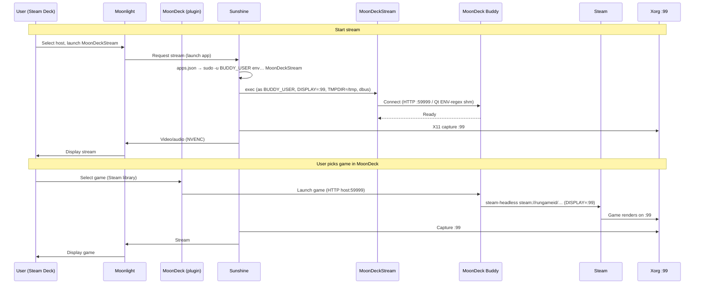

# Stream Deck → Moonlight → Sunshine on Linux

Automated setup for reliable game streaming from a Linux PC to a Steam Deck using Sunshine (server) and Moonlight (client), with a **MoonDeck-first** workflow: Sunshine exposes **MoonDeckStream** as the single launcher; the Deck’s MoonDeck plugin drives game selection (Steam library → Moonlight → Sunshine). The host runs **MoonDeck Buddy** to track Steam state and launch games.

## Prerequisites

- **Host:** Linux with NVIDIA GPU. Arch Linux is tested; see [docs/installing.md](docs/installing.md) for Debian/Ubuntu, Fedora, and other distros. On Arch, [yay](https://github.com/Jguer/yay) is used for AUR packages.
- **Deck:** Moonlight and the [MoonDeck](https://github.com/FrogTheFrog/moondeck) Decky plugin. The plugin requires MoonDeck Buddy installed on the host for pairing and game launch.

## Quickstart

```bash
./test-full-cycle.sh
```

To install with a different desktop user (for MoonDeck Buddy / Steam): `BUDDY_USER=myuser sudo ./install.sh`. See [docs/installing.md](docs/installing.md) for all options.

This will:
1. Install dependencies, MoonDeck Buddy, and configure services
2. Run health checks (including Buddy and Sunshine app presence)
3. Prompt you to launch MoonDeckStream (or Desktop) from Moonlight on the Steam Deck
4. Automatically collect diagnostic logs (also on health failure or Ctrl+C)
5. Print a summary and copy it to clipboard

## Architecture

This setup uses a dedicated Xorg display server session (`:99`) isolated from your normal desktop. This ensures:

- **Concurrent use**: Your desktop remains usable while streaming
- **Reliable capture**: Sunshine uses X11 capture backend on the isolated display
- **Headless-friendly**: Works without physical monitors via dummy Xorg and a fixed 1280×800 mode

Sunshine publishes **MoonDeckStream** (and optional Desktop / Steam Big Picture for debug). MoonDeck Buddy runs as your desktop user (`BUDDY_USER`, by default the user who invoked `sudo ./install.sh`) and is started via systemd user units; Sunshine runs as a dedicated stream user (default `streamdeck`) and invokes MoonDeckStream, which talks to Buddy over HTTP.

**Audio:** Sunshine cannot open the Buddy user’s Pulse/PipeWire socket (`/run/user/…/pulse`) from another uid. The Buddy user gets a PipeWire-Pulse drop-in (`pipewire/10-tcp-localhost.conf` → `~/.config/pipewire/pipewire-pulse.conf.d/`) that listens on `tcp:127.0.0.1:4713`; `streamdeck-sunshine.service` sets `PULSE_SERVER` to that address. See [docs/audio-pipeline.md](docs/audio-pipeline.md).

**Input isolation:** Moonlight forwards input through Sunshine virtual HID devices. Udev rules deploy a `seat` tag plus `LIBINPUT_IGNORE_DEVICE=1` so the desktop compositor (e.g. Hyprland) ignores those devices while the streaming Xorg session uses `xf86-input-evdev` and opens them by group/mode. Templates live under `udev/`.

If the distro ships a system **`sunshine.service`**, `install.sh` stops and disables it so only `streamdeck-sunshine.service` binds the streaming ports.



**Stream and game-launch sequence** (Deck → host):




## Repository layout

| Path | Role |
|------|------|
| `install.sh` | Idempotent setup: deps, Buddy, Xorg/Sunshine units, udev, sunshine.conf, apps.json, sudoers; health checks; runs `collect-logs.sh` on success and failure |
| `collect-logs.sh` | Diagnostics: journald, Sunshine/Xorg logs, GPU, udev, apps.json, Buddy journal, Steam client logs, input-device udev tags |
| `test-full-cycle.sh` | Runs `install.sh`, health gates (GPU, display, Buddy, MoonDeckStream in apps.json), manual Moonlight step, `collect-logs.sh`, `scripts/check-input-pipeline.sh`; Ctrl+C collects logs |
| `scripts/lib.sh` | Shared logging, health checks (`check_*`), helpers |
| `scripts/load-install-config.sh` | Loads `/etc/streamdeck/install.conf` (written by install); used by collect-logs, test cycle, check-input-pipeline |
| `scripts/steam-headless-wrapper.sh` | Installed as `/usr/local/bin/steam-headless` for Buddy’s `steam_exec_override` on `:99` |
| `scripts/moondeckstream-wrapper.sh` | Installed as `/usr/local/bin/MoonDeckStream` (real binary + singleton / lifecycle) |
| `scripts/check-input-pipeline.sh` | Strict PASS/FAIL checks on Sunshine virtual input and udev tags; writes `input-pipeline-summary.txt` into a log dir |
| `scripts/experiment-*.sh` | Optional one-off experiments (see headers inside each script); not required for install |
| `systemd/*.template` | Rendered to `/etc/systemd/system/streamdeck-{xorg,sunshine}.service` |
| `sunshine/*.template` | `sunshine.conf` and `apps.json` for `STREAM_USER` |
| `xorg/99-streamdeck.conf.template` | Dummy driver + 1280×800 modeline + evdev input class |
| `pipewire/10-tcp-localhost.conf` | Copied into Buddy user’s `pipewire-pulse.conf.d` for the audio TCP bridge |
| `udev/*.rules.template`, `udev/*.rules` | Templates: input isolation for Sunshine passthrough. Static rules (e.g. `99-streamdeck-tty.rules`) for tty group/mode used by headless Xorg |
| `sudoers.d/streamdeck-steam.template` | NOPASSWD for stream user to run Buddy-scoped commands |
| `copy-repo.sh` | Dev convenience: concatenates repo files to clipboard (`wl-copy`) |
| `docs/installing.md` | Distros, `BUDDY_USER` / `STREAM_USER`, `SKIP_DEPS`, `ADAPTER_NAME` |
| `docs/audio-pipeline.md` | PipeWire TCP bridge, sinks, validation |
| `docs/troubleshooting.md` | Health failures, Moonlight, firewall, exit codes |
| `AGENTS.md` | Contributor invariants (idempotency, logging, `collect-logs` sync) |

## Troubleshooting

See [docs/troubleshooting.md](docs/troubleshooting.md) for health-check failures, Moonlight connection issues, firewall, and common errors (Error 11, exit 134, resolution).

## Research sources

- [Sunshine Getting Started](https://docs.lizardbyte.dev/projects/sunshine/latest/md_docs_2getting__started.html)
- [Sunshine Configuration](https://docs.lizardbyte.dev/projects/sunshine/master/md_docs_2configuration.html)
- [MoonDeck Buddy Wiki](https://github.com/FrogTheFrog/moondeck-buddy/wiki) (install, Sunshine setup, configuration)
- [Official Headless Sunshine Setup Guide](https://app.lizardbyte.dev/2023-09-14-remote-ssh-headless-sunshine-setup/?lng=en-US)
