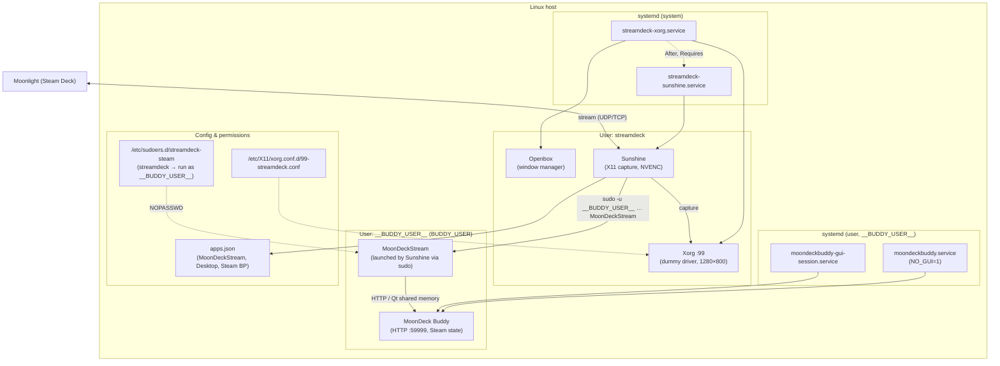
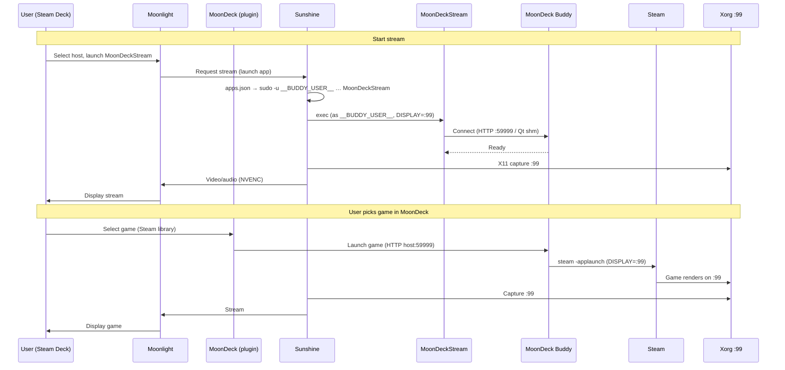

# Stream Deck → Moonlight → Sunshine on Linux

Automated setup for reliable game streaming from a Linux PC to a Steam Deck using Sunshine (server) and Moonlight (client), with a **MoonDeck-first** workflow: Sunshine exposes **MoonDeckStream** as the single launcher; the Deck’s MoonDeck plugin drives game selection (Steam library → Moonlight → Sunshine). The host runs **MoonDeck Buddy** to track Steam state and launch games.

## Prerequisites

- **Host:** Arch Linux (or compatible); NVIDIA GPU; [yay](https://github.com/Jguer/yay) for AUR.
- **Deck:** Moonlight and the [MoonDeck](https://github.com/FrogTheFrog/moondeck) Decky plugin. The plugin requires MoonDeck Buddy installed on the host for pairing and game launch.

## Quickstart

```bash
./test-full-cycle.sh
```

This will:
1. Install dependencies, MoonDeck Buddy, and configure services
2. Run health checks (including Buddy and Sunshine app presence)
3. Prompt you to launch MoonDeckStream (or Desktop) from Moonlight on the Steam Deck
4. Automatically collect diagnostic logs (also on health failure or Ctrl+C)
5. Print a summary and copy it to clipboard

## Architecture

This setup uses a dedicated Xorg display server session (`:99`) isolated from your normal desktop. This ensures:

- **Concurrent use**: Your desktop remains usable while streaming
- **Reliable capture**: Sunshine uses X11 capture backend on the isolated display
- **Headless-friendly**: Works without physical monitors via EDID override

Sunshine publishes **MoonDeckStream** (and optional Desktop / Steam Big Picture for debug). MoonDeck Buddy runs as your user (e.g. `__BUDDY_USER__`) and is started automatically via systemd user services; Sunshine (as `streamdeck`) invokes the MoonDeckStream binary, which talks to Buddy over HTTP.



**Stream and game-launch sequence** (Deck → host):




## Components

- `install.sh` - Idempotent setup (Sunshine, MoonDeck Buddy, systemd, apps.json); runs `collect-logs.sh` on success and on failure
- `collect-logs.sh` - Diagnostic log collection (Sunshine, Xorg, Buddy, MoonDeck); invoked automatically by install and test
- `test-full-cycle.sh` - End-to-end test with Buddy/Sunshine health gates and summary; runs `collect-logs.sh` after manual step, on health failure, and on Ctrl+C
- `docs/moondeck.md` - Pinned facts and links for MoonDeck Buddy and Sunshine app config
- `docs/troubleshooting.md` - Health-check failures, Moonlight issues, firewall, and common errors

## Troubleshooting

See [docs/troubleshooting.md](docs/troubleshooting.md) for health-check failures, Moonlight connection issues, firewall, and common errors (Error 11, exit 134, resolution).

## Research sources

- [Sunshine Getting Started](https://docs.lizardbyte.dev/projects/sunshine/latest/md_docs_2getting__started.html)
- [Sunshine Configuration](https://docs.lizardbyte.dev/projects/sunshine/master/md_docs_2configuration.html)
- [MoonDeck Buddy Wiki](https://github.com/FrogTheFrog/moondeck-buddy/wiki) (install, Sunshine setup, configuration)
- [Official Headless Sunshine Setup Guide](https://app.lizardbyte.dev/2023-09-14-remote-ssh-headless-sunshine-setup/?lng=en-US)
