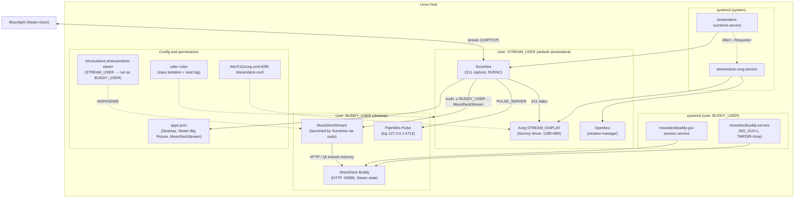
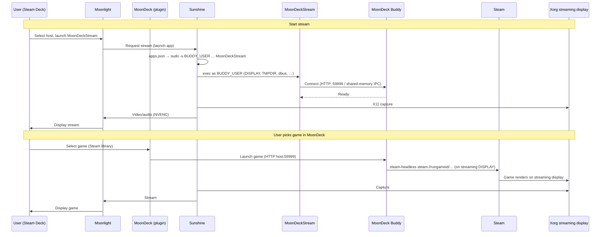

# Architecture

Technical reference for how this repository wires **Sunshine**, **Moonlight**, **MoonDeck**, and **MoonDeck Buddy** on the host. For install options and distros, see [installing.md](installing.md). For audio specifics, see [audio-pipeline.md](audio-pipeline.md).

## Overview

The host runs a **dedicated Xorg session** on a separate display number (default **`STREAM_DISPLAY=:99`**, configurable via `install.sh`). That session uses a **dummy video driver** and a fixed **1280×800** mode (Steam Deck native) so capture works **headless** and **without conflicting with your normal desktop** (no DRM master fight with the compositor’s GPU session).

- **Sunshine** runs as **`STREAM_USER`** (default `streamdeck`) under `streamdeck-sunshine.service`, captures video from that X session, and encodes with **NVENC** (NVIDIA GPU required today — see `install.sh` NVIDIA detection).
- **MoonDeck Buddy** and **Steam** run as **`BUDDY_USER`** (default: the user who ran `sudo ./install.sh`, overridable with `BUDDY_USER=…`). Buddy is started via **systemd user** units: `install.sh` writes a **`moondeckbuddy.service.d` override** with **`NO_GUI=1`** and **`TMPDIR=/tmp`** (Buddy must not depend on the desktop compositor for the headless stream path; `TMPDIR` aligns shared-memory IPC with MoonDeckStream). It also runs **`systemctl --user enable --now moondeckbuddy-gui-session.service`** when configuring Buddy (upstream unit shipped with Buddy; harmless if missing).
- **MoonDeckStream** is the Sunshine “app” you connect to from Moonlight. `install.sh` renders **`apps.json`** so Sunshine starts MoonDeckStream with `sudo -u BUDDY_USER` and the correct `DISPLAY`, `XDG_RUNTIME_DIR`, `DBUS_SESSION_BUS_ADDRESS`, and `TMPDIR=/tmp` (Buddy ↔ MoonDeckStream shared-memory key path). **`/etc/sudoers.d/streamdeck-steam`** grants narrowly scoped `NOPASSWD` for that pattern.

If the distribution ships a system **`sunshine.service`**, **`install.sh` stops and disables it** so only **`streamdeck-sunshine.service`** owns the streaming ports.

## Audio

Sunshine (`STREAM_USER`) cannot open the Buddy user’s Pulse/PipeWire socket under `/run/user/<buddy_uid>/` (permissions). **`install.sh`** deploys a PipeWire-Pulse drop-in (`pipewire/10-tcp-localhost.conf` → `~/.config/pipewire/pipewire-pulse.conf.d/`) so **`pipewire-pulse` also listens on `tcp:127.0.0.1:4713`**. **`streamdeck-sunshine.service`** sets `PULSE_SERVER=tcp:127.0.0.1:4713`. Details and validation: [audio-pipeline.md](audio-pipeline.md).

## Input isolation

Moonlight input is forwarded through **Sunshine virtual HID** devices. **`udev/85-streamdeck-sunshine-input-isolation.rules`** (rendered from the template under `install.sh`) sets **`TAG+="seat"`**, **`GROUP`/`MODE`** for **`STREAM_GROUP`**, and **`ENV{LIBINPUT_IGNORE_DEVICE}=1`** on those nodes so **desktop compositors using libinput** ignore them, while the streaming Xorg stack uses **`xf86-input-evdev`**, which opens devices by node permissions and does not consult `LIBINPUT_IGNORE_DEVICE`. The Xorg config (**`xorg/99-streamdeck.conf`**) restricts which devices the `:99` server uses. Do **not** set `ID_SEAT` on parent devices in custom rules — see [troubleshooting.md](troubleshooting.md).

## System diagram

## Stream and game-launch sequence

## Repository layout

| Path | Role |
|------|------|
| `install.sh` | Idempotent setup: deps, Buddy, Xorg/Sunshine units, udev, `sunshine.conf`, `apps.json`, sudoers; health checks; runs `collect-logs.sh` on success and failure |
| `collect-logs.sh` | Diagnostics: journald, Sunshine/Xorg logs, GPU, udev, `apps.json`, Buddy journal, Steam client logs, input-device udev tags |
| `test-full-cycle.sh` | Runs `install.sh`, health gates, manual Moonlight step, `collect-logs.sh`, `scripts/check-input-pipeline.sh`; Ctrl+C collects logs |
| `scripts/lib.sh` | Shared logging, health checks (`check_*`), helpers |
| `scripts/load-install-config.sh` | Loads `/etc/streamdeck/install.conf`; used by collect-logs, test cycle, check-input-pipeline |
| `scripts/steam-headless-wrapper.sh` | Installed as `/usr/local/bin/steam-headless` for Buddy’s `steam_exec_override` on the streaming display |
| `scripts/moondeckstream-wrapper.sh` | Installed as `/usr/local/bin/MoonDeckStream` (real binary + singleton / lifecycle) |
| `scripts/check-input-pipeline.sh` | Strict PASS/FAIL checks on Sunshine virtual input and udev tags |
| `scripts/experiment-*.sh` | Optional one-off experiments; not required for install |
| `systemd/*.template` | Rendered to `/etc/systemd/system/streamdeck-{xorg,sunshine}.service` |
| `sunshine/*.template` | `sunshine.conf` and `apps.json` for `STREAM_USER` |
| `xorg/99-streamdeck.conf.template` | Dummy driver + 1280×800 modeline + evdev input class |
| `pipewire/10-tcp-localhost.conf` | Copied into Buddy user’s `pipewire-pulse.conf.d` for the audio TCP bridge |
| `udev/*.rules.template`, `udev/*.rules` | Input isolation for Sunshine passthrough; static rules (e.g. TTY) for headless Xorg |
| `sudoers.d/streamdeck-steam.template` | NOPASSWD for stream user to run Buddy-scoped launch commands |

## References

- [Sunshine Getting Started](https://docs.lizardbyte.dev/projects/sunshine/latest/md_docs_2getting__started.html)
- [Sunshine Configuration](https://docs.lizardbyte.dev/projects/sunshine/master/md_docs_2configuration.html)
- [MoonDeck Buddy Wiki](https://github.com/FrogTheFrog/moondeck-buddy/wiki)
- [Headless Sunshine setup (LizardByte)](https://app.lizardbyte.dev/2023-09-14-remote-ssh-headless-sunshine-setup/?lng=en-US)
