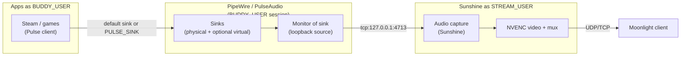
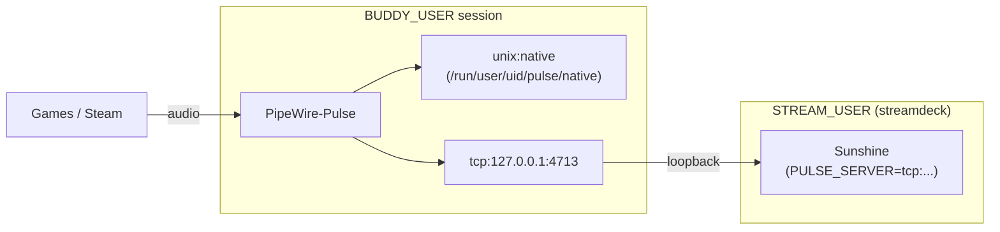

# Audio pipeline (Stream Deck -> Sunshine -> Moonlight)

This document describes **how audio is intended to work** in this repository's layout, how that maps to **Sunshine** and **PulseAudio/PipeWire**, and how to **validate** or **narrow down** failures when the client hears no audio or the wrong audio.

Official Sunshine reference: [configuration -- audio](https://docs.lizardbyte.dev/projects/sunshine/master/md_docs_2configuration.html) (`audio_sink`, `virtual_sink`, `stream_audio`).

---

## Roles and users

| Component | Typical user | Why it matters for audio |
|-----------|--------------|---------------------------|
| **Sunshine** | `STREAM_USER` (default `streamdeck`) | Sunshine is the process that **captures** audio and muxes it into the stream. It runs under `streamdeck-sunshine.service` with `DISPLAY=:99`. The unit sets `PULSE_SERVER=tcp:127.0.0.1:4713` to reach Buddy's PipeWire. |
| **Games / Steam / MoonDeckStream** | `BUDDY_USER` (desktop user) | Apps are launched with `sudo -u BUDDY_USER` and **`XDG_RUNTIME_DIR=/run/user/<buddy_uid>`** so they attach to **that user's** PipeWire/Pulse session. |

So: **video capture** is scoped to the isolated Xorg display (`:99`), but **application audio** flows through **the Buddy user's** sound server and is bridged to Sunshine via TCP localhost (see below).

---

## Intended pipeline (conceptual)



**Narrow mental model:**

1. **Producers:** Games and Steam write PCM to a **sink** (default sink, or a sink named by `PULSE_SINK`).
2. **Capture:** Sunshine records from an **audio sink** you configure (see Sunshine's `audio_sink`), which in practice means "the **monitor** of that sink" -- i.e. what you would hear on that output.
3. **Transport:** Encoded A/V goes to Moonlight; the client plays audio.

Sunshine can also use **`virtual_sink`** so streamed audio goes to a dedicated virtual device and host speakers can be muted; that is an alternative pattern to naming a real sink in `audio_sink`.

---

## How audio bridging works (TCP localhost)

Sunshine runs as `STREAM_USER` (`streamdeck`), which **cannot** access `BUDDY_USER`'s per-user PipeWire socket (`/run/user/<uid>/pulse/native` is behind a `0700` directory). Without a bridge, Sunshine logs:

```text
Error: Couldn't connect to pulseaudio: Access denied
Error: Unable to initialize audio capture. The stream will not have audio.
```

**Solution:** `install.sh` deploys a PipeWire-Pulse **drop-in** for `BUDDY_USER` that makes `pipewire-pulse` also listen on **`tcp:127.0.0.1:4713`**, and the Sunshine systemd unit sets **`PULSE_SERVER=tcp:127.0.0.1:4713`**. Sunshine connects over TCP on loopback to the same PipeWire graph that games use -- no filesystem ACL gymnastics, survives reboots (PipeWire reads the drop-in on every start).

**Files involved:**

| File | What it does |
|------|-------------|
| `pipewire/10-tcp-localhost.conf` | Drop-in deployed to `~/.config/pipewire/pipewire-pulse.conf.d/`; adds `tcp:127.0.0.1:4713` with `client.access = "unrestricted"`. |
| `systemd/streamdeck-sunshine.service.template` | Sets `Environment=PULSE_SERVER=tcp:127.0.0.1:4713` for Sunshine. |
| `install.sh` | Copies the drop-in, restarts `pipewire-pulse.service`, runs `check_audio_tcp` health check. |
| `scripts/lib.sh` (`check_audio_tcp`) | Health check: `sudo -u streamdeck PULSE_SERVER=tcp:127.0.0.1:4713 pactl info`. |



**Security note:** The TCP listener binds to `127.0.0.1` only (not `0.0.0.0`), so only local processes can connect. PipeWire applies `client.access = "unrestricted"`, giving TCP clients the same graph-mutation rights as local Unix clients (load/unload sink modules, set-default-sink). Sunshine **requires** this at stream start to create its virtual sink and route audio capture. Using `"restricted"` would allow connect + list but deny `set-default-sink` → "Access denied" → no audio. This is the same trust boundary as the Unix socket -- any local user can connect, but remote hosts cannot.

---

## What this repo actually wires today

### `PULSE_SINK=StreamDeck-Bridge` (Steam Big Picture only)

The install template sets `PULSE_SINK=StreamDeck-Bridge` only for the **"Steam Big Picture"** Sunshine app:

```17:17:sunshine/apps.json.template
      "cmd": "sudo -u __BUDDY_USER__ HOME=/home/__BUDDY_USER__ USER=__BUDDY_USER__ XDG_RUNTIME_DIR=/run/user/__BUDDY_UID__ DBUS_SESSION_BUS_ADDRESS=unix:path=/run/user/__BUDDY_UID__/bus PULSE_SINK=StreamDeck-Bridge DISPLAY=:99 steam -gamepadui --disable-gpu --disable-software-rasterizer",
```

**Sudoers** allows `PULSE_SINK` to survive `sudo` for the stream user -> Buddy user transition:

```17:17:sudoers.d/streamdeck-steam.template
Defaults:__STREAM_USER__ env_keep += "HOME USER XDG_CONFIG_HOME XDG_RUNTIME_DIR DBUS_SESSION_BUS_ADDRESS DISPLAY PULSE_SINK SUNSHINE_LAUNCHED TMPDIR __NV_PRIME_RENDER_OFFLOAD __GLX_VENDOR_LIBRARY_NAME __VK_LAYER_NV_optimus"
```

**Important:** `install.sh` does **not** create a sink named `StreamDeck-Bridge`. That name is a **convention** you (or your distro) must implement with PipeWire/Pulse (e.g. null sink + optional link to the default sink). If the sink does not exist, Steam may fail to open audio or fall back unpredictably.

### MoonDeckStream path (no `PULSE_SINK` in template)

The **MoonDeckStream** app command does **not** set `PULSE_SINK`:

```21:22:sunshine/apps.json.template
      "cmd": "sudo -u __BUDDY_USER__ HOME=/home/__BUDDY_USER__ USER=__BUDDY_USER__ XDG_RUNTIME_DIR=/run/user/__BUDDY_UID__ DBUS_SESSION_BUS_ADDRESS=unix:path=/run/user/__BUDDY_UID__/bus TMPDIR=/tmp DISPLAY=:99 SUNSHINE_LAUNCHED=1 __NV_PRIME_RENDER_OFFLOAD=1 __GLX_VENDOR_LIBRARY_NAME=nvidia __VK_LAYER_NV_optimus=NVIDIA_only /usr/local/bin/MoonDeckStream",
```

So for the primary MoonDeck workflow, games launched by Buddy (via `steam-headless`) use the **default** sink. If Sunshine's `audio_sink` points at a different node than where game audio actually plays, the stream can be **silent** while the host still has sound (or vice versa).

### Sunshine config template (no explicit `audio_sink`)

`sunshine/sunshine.conf.template` does not set `audio_sink`, `virtual_sink`, or `stream_audio`. Sunshine therefore uses its **defaults** (audio streaming enabled; sink selection per Sunshine's default logic). To make the pipeline deterministic, set `audio_sink` (and optionally `virtual_sink`) explicitly in `sunshine.conf` to match your PipeWire graph -- see validation below.

---

## Validation: "is the purported pipeline real?"

Work through these in order; each step localizes **which hop** is wrong.

### 1) TCP listener active

```bash
sudo -u streamdeck PULSE_SERVER=tcp:127.0.0.1:4713 pactl info
```

**Pass:** Shows `Server Name: PulseAudio (on PipeWire ...)` and `Default Sink: ...`.

**Fail:** `pipewire-pulse` is not listening on TCP. Check that the drop-in exists (`~/.config/pipewire/pipewire-pulse.conf.d/10-tcp-localhost.conf`) and restart: `systemctl --user restart pipewire-pulse.service`.

### 2) Confirm Sunshine thinks audio is OK

- After a stream session, open the log bundle from `./collect-logs.sh` and read **`sunshine-diagnostics.txt`**: it greps Sunshine logs and the `streamdeck-sunshine` journal for `audio`, `pulse`, `pipewire`, `Unable to initialize audio` (see `collect-logs.sh`).
- **Pass:** No initialization errors; session starts cleanly.
- **Fail:** "Couldn't connect to pulseaudio" -> Sunshine cannot reach the TCP listener. Check that `streamdeck-sunshine.service` has `PULSE_SERVER=tcp:127.0.0.1:4713` and that step 1 passes.

### 3) List sinks as **both** users

Run **as `BUDDY_USER`** (with `XDG_RUNTIME_DIR` set if needed):

```bash
pactl info
pactl list short sinks
```

Run **as `STREAM_USER`** (through the TCP bridge):

```bash
sudo -u streamdeck PULSE_SERVER=tcp:127.0.0.1:4713 pactl list short sinks
```

**Pass:** Both show the **same** sinks (they are on the same PipeWire graph).

### 4) Does `StreamDeck-Bridge` exist (if you rely on it)?

As `BUDDY_USER`:

```bash
pactl list short sinks | grep -i streamdeck || true
```

**Pass:** A sink whose **name** matches what you passed in `PULSE_SINK` (e.g. `StreamDeck-Bridge`).

**Fail:** Create it (PipeWire: `pw-load-module` null sink, or PulseAudio `module-null-sink` with `sink_name=StreamDeck-Bridge`), **or** stop using `PULSE_SINK` until it exists.

### 5) Align Sunshine `audio_sink` with reality

Sunshine's `audio_sink` must name the sink whose **monitor** you want to capture (see upstream docs). Discover names:

```bash
pactl list short sinks
```

Set in `/home/<STREAM_USER>/.config/sunshine/sunshine.conf` (deployed from the template by install), then restart `streamdeck-sunshine.service`.

**Pass:** The named sink is the one receiving game audio (directly or via `PULSE_SINK`).

### 6) End-to-end "is anything on the meter?"

While a game or Steam plays **on the host**:

- Use **`pavucontrol`** or **`pw-top`** / **`helvum`** as `BUDDY_USER` and confirm the stream moves the expected sink.
- Optionally play a sine wave into `StreamDeck-Bridge` (if defined) and confirm Sunshine's stream carries it.

**Pass:** Visual level on the target sink; Moonlight hears it.

### 7) Client-side sanity

- Moonlight volume not muted; try another Sunshine app (**Desktop** vs **Steam Big Picture**) to see if only one path sets `PULSE_SINK`.

---

## Systematic narrowing when audio does not work

Use a **binary split** on the graph:

| Symptom | Likely layer | What to check |
|--------|----------------|---------------|
| Sunshine log shows **PulseAudio/PipeWire connect errors** | Sunshine <-> sound server | `check_audio_tcp` / step 1; `streamdeck-sunshine.service` env; `pipewire-pulse` TCP drop-in. |
| **Host has sound**, Moonlight **silent** | Wrong capture sink or wrong user session | `audio_sink` vs actual sink; `PULSE_SINK` not set for MoonDeck path. |
| **Moonlight silent**, **host silent** for the game | App not producing audio / wrong sink | Game settings; `PULSE_SINK` typo; sink missing; Proton/audio backend. |
| **Steam Big Picture** app silent but **Desktop** ok | `StreamDeck-Bridge` / `PULSE_SINK` | Sink exists; Steam error logs; revert `PULSE_SINK` temporarily to test default sink + Sunshine `audio_sink` on default monitor. |
| **Crackling / latency** | Buffering / load | CPU; PipeWire quantum; Sunshine logs; try reducing game audio quality. |

**Minimal reproducible comparison:**

1. Sunshine app **Desktop** + `speaker-test` or `aplay` in `xterm` on `:99` -- tests **capture + encode + client** without Steam.
2. **Steam Big Picture** app -- tests **`PULSE_SINK=StreamDeck-Bridge`** specifically.
3. **MoonDeckStream** -- tests **Buddy + wrapper + default sink**; add `PULSE_SINK` only after (1-2) pass.

---

## Summary

- **Design intent:** Game audio enters PipeWire/Pulse (Buddy's session); Sunshine (stream user) captures via TCP loopback (`PULSE_SERVER=tcp:127.0.0.1:4713`) and sends it to Moonlight.
- **Audio bridge:** `install.sh` deploys `pipewire/10-tcp-localhost.conf` to Buddy's `pipewire-pulse.conf.d/` and sets `PULSE_SERVER` in Sunshine's unit. Health check: `check_audio_tcp` in `lib.sh`.
- **First gate:** If `sunshine-diagnostics.txt` shows "Couldn't connect to pulseaudio", fix the TCP bridge (step 1) before tuning sinks.
- **Repo reality:** Only the **Steam Big Picture** template sets `PULSE_SINK`; the sink is **not** created by `install.sh`; **MoonDeckStream** does not set it; **`sunshine.conf.template`** does not pin `audio_sink`.
- **Validation:** TCP listener -> Sunshine logs -> two-user `pactl` -> sink existence -> `audio_sink` match -> live meters -> isolate app vs capture vs client.

For video/black-screen and MoonDeck-specific issues, see [troubleshooting.md](troubleshooting.md).
