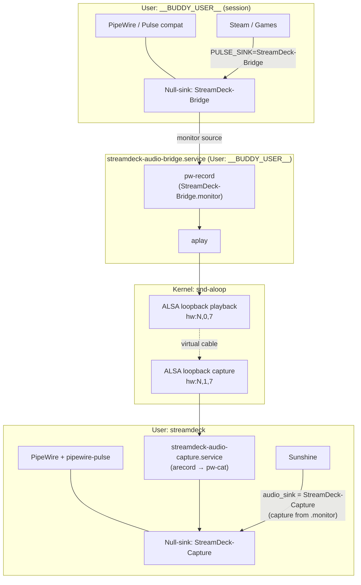
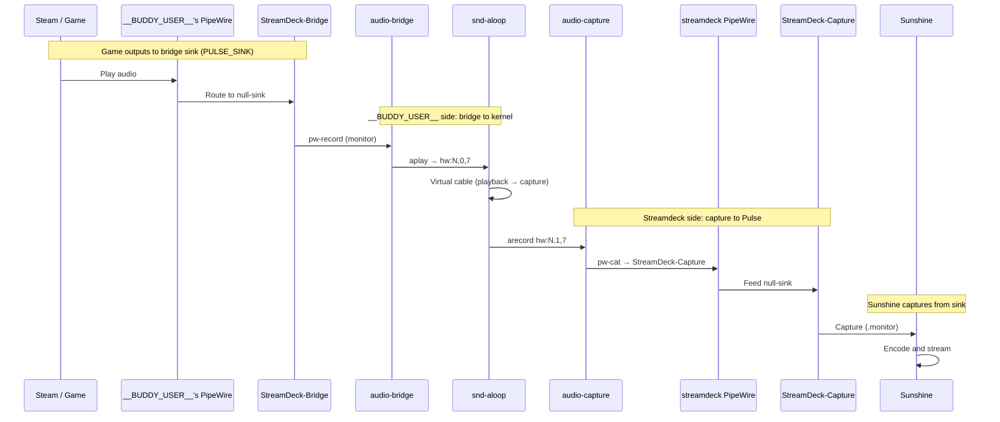

# Audio Solution: Architecture and Sequence

This document describes the Stream Deck audio solution using ALSA loopback as a cross-user bridge. Sunshine (user `streamdeck`) cannot access __BUDDY_USER__'s PipeWire session; the bridge routes game audio through kernel ALSA loopback so streamdeck can capture it.

## Problem (Why the bridge exists)

| Actor | User | Audio need |
|-------|------|------------|
| Steam / games | __BUDDY_USER__ | Output to __BUDDY_USER__'s PipeWire (`/run/user/1000`) |
| Sunshine | streamdeck | Capture audio for the stream |

Cross-user Pulse/PipeWire access is not allowed (socket auth, runtime dir). So: **__BUDDY_USER__'s audio → ALSA loopback (kernel) → streamdeck's PipeWire → Sunshine**. No direct cross-user socket access.

---

## Architecture



**Component summary**

| Component | User | Purpose |
|-----------|------|---------|
| **PipeWire (__BUDDY_USER__)** | __BUDDY_USER__ | Desktop audio; exposes null-sink `StreamDeck-Bridge`. |
| **streamdeck-audio-bridge** | __BUDDY_USER__ | `pw-record` from `StreamDeck-Bridge.monitor` → `aplay` to ALSA loopback playback (subdevice 7). |
| **snd-aloop** | kernel | Virtual ALSA card; playback (0,7) and capture (1,7) are connected by a virtual cable. |
| **streamdeck-pipewire** | streamdeck | Headless PipeWire-Pulse in `/run/streamdeck-audio`; Sunshine’s Pulse server. |
| **streamdeck-audio-capture** | streamdeck | `arecord` from ALSA loopback capture (1,7) → `pw-cat` into sink `StreamDeck-Capture`. |
| **Sunshine** | streamdeck | Captures from `StreamDeck-Capture` (Pulse) and encodes into the stream. |

Subdevice **7** is used so PipeWire’s auto-use of subdevice **0** does not conflict with the bridge.

---

## Service startup order

```mermaid
flowchart LR
  A[user@1000.service\nben session] --> B[streamdeck-audio-bridge]
  B --> C[streamdeck-pipewire]
  C --> D[streamdeck-audio-capture]
  D --> E[streamdeck-sunshine]

  style A fill:#e1f5e1
  style B fill:#fff4e1
  style C fill:#e1f0ff
  style D fill:#e1f0ff
  style E fill:#e1f0ff
```

- **audio-bridge** requires __BUDDY_USER__’s session (PipeWire); creates null-sink and feeds ALSA loopback.
- **pipewire** provides streamdeck’s Pulse socket before capture and Sunshine.
- **audio-capture** creates `StreamDeck-Capture` and feeds it from ALSA loopback before Sunshine starts.
- **Sunshine** starts last and binds to `StreamDeck-Capture` for audio capture.

---

## Runtime data flow (sequence)

End-to-end path from game playback to Sunshine capture:



---

## Key configuration

| Where | What |
|-------|------|
| **Apps (Sunshine)** | `PULSE_SINK=StreamDeck-Bridge` (and __BUDDY_USER__’s `XDG_RUNTIME_DIR` etc.) so game audio goes to the bridge sink. |
| **Sunshine** | `audio_sink = StreamDeck-Capture` so capture uses the sink fed by the capture bridge. |
| **Scripts** | `LOOPBACK_SUBDEVICE=7` in both `audio-bridge.sh` and `audio-capture-bridge.sh` (must match). |
| **streamdeck** | In `audio` group for ALSA device access. |

---

## Prerequisites and limits

- **__BUDDY_USER__’s session must be up**: audio-bridge runs as __BUDDY_USER__ and needs PipeWire; install/health checks fail clearly if the session is not active.
- **Start order**: audio-bridge → streamdeck-pipewire → streamdeck-audio-capture → streamdeck-sunshine (see service `After`/`Before` and install.sh).
- **Single bridge path**: No automatic sink selection; games must use `PULSE_SINK=StreamDeck-Bridge`.

See also: `AUDIO_IMPLEMENTATION_PLAN.md`, `AUDIO_PROBLEM_SUMMARY.md`, `docs/troubleshooting.md`.
