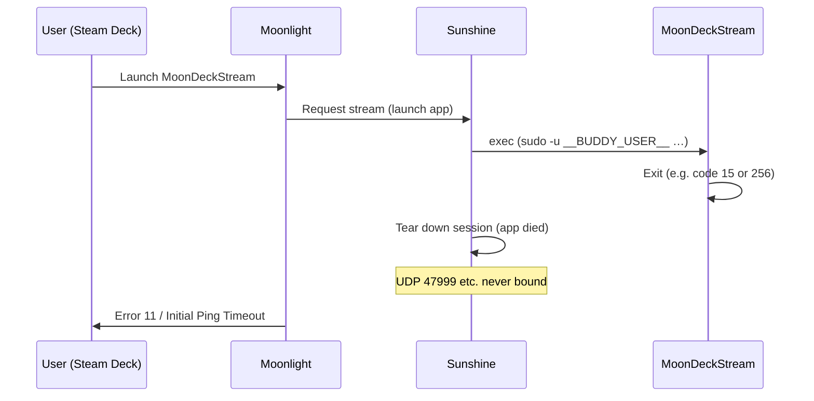

# Troubleshooting

## Health checks or test-full-cycle fail

Logs are collected automatically (install and test-full-cycle both run `collect-logs.sh`). To capture logs manually, run `./collect-logs.sh`. The bundle includes:

- Sunshine and Xorg logs
- **MoonDeck Buddy:** `/tmp/moondeck*.log`, user journal for `moondeckbuddy.service` / `moondeckbuddy-gui-session.service`, and `~/.config/moondeckbuddy/settings.json`
- A grep summary for Buddy/MoonDeck (errors, port, listen, pair, etc.)

Common issues:

1. **Xorg not starting**: Check NVIDIA driver and EDID configuration
2. **Sunshine can't see display**: Verify `DISPLAY=:99` is set correctly
3. **Encoder init fails**: Check NVENC availability with `nvidia-smi`
4. **Buddy not running**: Start with `sudo -u __BUDDY_USER__ systemctl --user start moondeckbuddy.service`. If autostart was never set up: `sudo -u __BUDDY_USER__ MoonDeckBuddy --enable-autostart` then `sudo -u __BUDDY_USER__ systemctl --user enable --now moondeckbuddy.service`
5. **First pairing**: Pairing and general behaviour are described in the [MoonDeck plugin docs](https://github.com/FrogTheFrog/moondeck); the plugin explicitly requires Buddy installed on the host

## Moonlight connection issues

- Ensure Sunshine is running: `systemctl status streamdeck-sunshine`
- Verify pairing PIN matches
- **Firewall:** If Moonlight shows "Starting control stream establishment" then fails, or Sunshine logs "Initial Ping Timeout", open the Sunshine and Buddy ports (see **Firewall** below).
- Buddy (MoonDeck): default port **59999** (TCP).

## Firewall (Initial Ping Timeout / control stream establishment)

**First check:** If the test summary **Post-connection port state** shows `UDP 47999: (none)` (and other Sunshine UDP as (none)), Sunshine never bound those ports because the **app (MoonDeckStream) exited** — fix the app exit (see "Desktop streams but MoonDeckStream fails" above); opening firewall will not help.

Sunshine needs the following ports open on the **host** (Arch Linux). If UDP is blocked *and* Sunshine has bound the ports (you would see a PID for sunshine on UDP in port state), you get "Initial Ping Timeout" or Moonlight asks to check UDP firewall (e.g. 47999).

**Sunshine — open all of these:**

| Port  | Protocol | Purpose        |
|-------|----------|----------------|
| 47984 | TCP      | Web UI (pairing) |
| 47989 | TCP      | Control        |
| 47990 | TCP      | Web UI (HTTPS) |
| 47998 | UDP      | Streaming      |
| 47999 | UDP      | Streaming      |
| 48000 | UDP      | Streaming      |
| 48002 | UDP      | Streaming      |
| 48010 | TCP+UDP  | Streaming      |
| 5353  | UDP      | mDNS/Avahi     |

**Buddy (MoonDeck):** 59999 TCP (only if client needs to reach Buddy directly; often same LAN).

**Examples (run as root):**

```bash
# ufw
ufw allow 47984/tcp
ufw allow 47989/tcp
ufw allow 47990/tcp
ufw allow 47998/udp
ufw allow 47999/udp
ufw allow 48000/udp
ufw allow 48002/udp
ufw allow 48010/tcp
ufw allow 48010/udp
ufw allow 5353/udp
ufw allow 59999/tcp
ufw reload

# firewalld
firewall-cmd --permanent --add-port=47984/tcp --add-port=47989/tcp --add-port=47990/tcp
firewall-cmd --permanent --add-port=47998/udp --add-port=47999/udp --add-port=48000/udp --add-port=48002/udp --add-port=48010/udp --add-port=5353/udp
firewall-cmd --permanent --add-port=48010/tcp --add-port=59999/tcp
firewall-cmd --reload
```

## Why different errors: normal (__BUDDY_USER__ session) vs :99 (install.sh)

If you run Sunshine + MoonDeck + Steam **normally** in your user session (physical monitors), you may see **"cannot initialize capture device"** when starting a stream. If you run the **install.sh** setup (Sunshine on :99, MoonDeckStream via sudo), you see **Error 11 / Initial Ping Timeout** instead. The difference is **where** the failure happens:

| Setup | What happens | Error you see |
|-------|----------------|---------------|
| **Normal (__BUDDY_USER__, DISPLAY=:1)** | Sunshine starts the app (MoonDeckStream/game). The app **stays running**. Sunshine establishes the session and binds the UDP control channel, then tries to capture the display. Capture fails (e.g. access to display/encoder). | "Cannot initialize capture device" (or similar) — failure is at **capture**, not at session setup. |
| **:99 (install.sh)** | Sunshine starts MoonDeckStream via `sudo -u __BUDDY_USER__` on DISPLAY=:99. MoonDeckStream **exits immediately** (e.g. code 15 or 256 — singleton, missing env, or other failure). Sunshine tears down the session; the UDP control channel is never established, so UDP 47999 etc. stay unbound. | **Error 11 / Initial Ping Timeout** — failure is **before** capture; the app died, so the session never fully establishes and Moonlight times out. Post-connection port state shows UDP (none). |

So: **normal run logs** (with "cannot initialize capture device") show that when the app stays alive, the control channel is established and the failure is later (capture). **:99 logs** (App exited with code [256], UDP 47999 not bound) show that when the app exits right away, the session never establishes — hence Error 11. Fixing the :99 path means making MoonDeckStream stay running (env, singleton cleanup); fixing the normal path would mean fixing capture (out of scope per your note).

## Desktop streams but MoonDeckStream fails (Error 11 / Initial Ping Timeout)

If you can stream **Desktop** (or other Sunshine apps) with Moonlight but launching **MoonDeckStream** gives Error 11 or "Initial Ping Timeout", the cause is **MoonDeckStream exiting** shortly after Sunshine starts it — not the firewall or Sunshine itself. When the app exits, Sunshine tears down the session and **does not bind the UDP control ports** (47998, 47999, etc.). Moonlight then times out waiting for the control channel.

**Failure sequence** (early exit → no UDP bind → Error 11):



**Confirm root cause:** In the test summary, **Post-connection port state** will show `UDP 47999: (none)` (and other UDP as (none)). That means Sunshine never established the session — i.e. the app exited, not a firewall block. If UDP were bound and Moonlight still failed, then firewall would be in play.

1. **Check exit code:** Test summary **Stream session (MoonDeckStream)** shows "App exited with code [15]" or "[256]" (or similar).
2. **Exit 15:** Often indicates the process was terminated (e.g. signal 15 = SIGTERM) or MoonDeckStream exited with status 15. Check `moondeckstream-stderr.log` and Buddy logs in the collected log dir for errors (e.g. cannot reach Buddy, Qt/shm failure, D-Bus). Ensure Buddy is running and reachable (see step 6).
3. **Exit 256 (root cause):** MoonDeckStream's stream helper only stays running if it sees an env var whose *name* matches `SUNSHINE.*` or `APOLLO.*` (see Buddy log "ENV regex from Buddy"). When Sunshine launches the app via `sudo -u <buddy_user> ...`, `sudo` does not pass Sunshine's own env, so the helper saw no such var and exited. **Fix:** The install template now passes `SUNSHINE_LAUNCHED=1` and the `/usr/local/bin/MoonDeckStream` wrapper sets it and kills any stale instance (see next).
4. **Exit 256 "Another instance already running":** MoonDeckStream is a singleton. If a previous run didn't exit cleanly, a new launch exits 256. The install's wrapper kills any stale MoonDeckStream for your user before starting. Check `moondeckstream-stderr.log` in the log dir for this message.
5. **Check MoonDeckStream logs:** In the collected log dir, look at `moondeckstream.log` (Sunshine's app output) and `/tmp/moondeckstream.log` (Buddy/MoonDeckStream often log there). These may show why it exited (e.g. cannot reach Buddy, missing env, D-Bus).
6. **Env:** The install runs MoonDeckStream as your Buddy user with `DISPLAY=:99`, `XDG_RUNTIME_DIR`, and `DBUS_SESSION_BUS_ADDRESS` (session bus). Re-run `install.sh` to deploy the latest `apps.json` if you changed the template.
7. **Buddy reachable:** Buddy must be running and reachable (e.g. `https://localhost:59999/apiVersion` in a browser). See [Buddy troubleshooting](https://github.com/FrogTheFrog/moondeck-buddy/wiki/Troubleshooting#windowslinux-buddy-appears-offlinecannot-be-paired). If Buddy had just crashed and restarted (e.g. moondeckbuddy.service "Failed with result 'exit-code'" then "Server started listening at port 59999"), ensure you retry after Buddy is stable.
8. **Reproduce locally:** Run MoonDeckStream with the same env Sunshine uses and capture stderr: `sudo ./experiment.sh` (or run as your user with `DISPLAY=:99` and the same env from the Sunshine log "Executing: [...]"); check `logs/experiment-<timestamp>/findings.txt`.

## MoonDeckStream starts then closes (exit 134)

If the stream starts and then closes immediately with **exit 134** (SIGABRT):

1. **Root cause (exit 134):** MoonDeckStream uses Qt shared memory/semaphore to talk to MoonDeck Buddy. If MoonDeckStream runs as user `streamdeck` while Buddy runs as your desktop user (e.g. `__BUDDY_USER__`), the process gets "permission denied" on the semaphore and aborts. **Fix:** Sunshine must launch MoonDeckStream as the same user as Buddy. The install uses `apps.json.template` with placeholders `__BUDDY_USER__` / `__BUDDY_UID__`; re-run `install.sh` and ensure `/etc/sudoers.d/streamdeck-steam` includes `NOPASSWD: /usr/local/bin/MoonDeckStream` for your Buddy user.
2. **Reproducing:** Run `sudo ./experiment.sh` and check `logs/experiment-<timestamp>/findings.txt` for the abort reason.
3. **Known behaviour:** With `wait-all: false`, when MoonDeckStream exits, Sunshine ends the stream.

## Resolution / scaling (black borders, wrong size)

MoonDeck troubleshooting calls out display and scaling causes (e.g. Gamescope resolution, "pass resolution to Moonlight"). Set Moonlight display resolution to native where possible, and be aware of external display being primary on the Deck.
