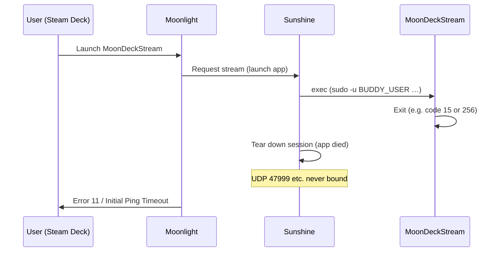

# Troubleshooting

## Health checks or test-full-cycle fail

Logs are collected automatically (install and test-full-cycle both run `collect-logs.sh`). To capture logs manually, run `./collect-logs.sh`. The bundle includes:

- Sunshine and Xorg logs
- **MoonDeck Buddy:** `/tmp/moondeck*.log`, user journal for `moondeckbuddy.service` / `moondeckbuddy-gui-session.service`, and `~/.config/moondeckbuddy/settings.json`
- A grep summary for Buddy/MoonDeck (errors, port, listen, pair, etc.)
- **`steam-game-launch.txt`** — Buddy `steam://` / AppID watch lines plus Steam log greps (`gameprocess_log`, `console-linux`, `webhelper`) to see whether a game ever entered Steam’s running list after Buddy sent `steam://launch/…/dialog`

Common issues:

1. **Xorg not starting**: Check NVIDIA driver and EDID configuration
2. **Sunshine can't see display**: Verify `DISPLAY=:99` is set correctly
3. **Encoder init fails**: Check NVENC availability with `nvidia-smi`
4. **Buddy not running**: Start with `sudo -u BUDDY_USER systemctl --user start moondeckbuddy.service` (replace BUDDY_USER with your desktop user, or set the env var). If autostart was never set up: `sudo -u BUDDY_USER MoonDeckBuddy --enable-autostart` then `sudo -u BUDDY_USER systemctl --user enable --now moondeckbuddy.service`. See [docs/installing.md](installing.md) for BUDDY_USER.
5. **First pairing**: Pairing and general behaviour are described in the [MoonDeck plugin docs](https://github.com/FrogTheFrog/moondeck); the plugin explicitly requires Buddy installed on the host

## Moonlight connection issues

- Ensure Sunshine is running: `systemctl status streamdeck-sunshine`
- Verify pairing PIN matches
- **Firewall:** If Moonlight shows "Starting control stream establishment" then fails, or Sunshine logs "Initial Ping Timeout", open the Sunshine and Buddy ports (see **Firewall** below).
- Buddy (MoonDeck): default port **59999** (TCP).

## Firewall (Initial Ping Timeout / control stream establishment)

**First check:** If the test summary **Post-connection port state** shows `UDP 47999: (none)` (and other Sunshine UDP as (none)), Sunshine never bound those ports because the **app (MoonDeckStream) exited** — fix the app exit (see "Desktop streams but MoonDeckStream fails" above); opening firewall will not help.

Sunshine needs the following ports open on the **host**. If UDP is blocked *and* Sunshine has bound the ports (you would see a PID for sunshine on UDP in port state), you get "Initial Ping Timeout" or Moonlight asks to check UDP firewall (e.g. 47999).

**Sunshine — open all of these:**

| Port  | Protocol | Purpose        |
|-------|----------|----------------|
| 47984 | TCP      | Web UI (pairing) |
| 47989 | TCP      | Control        |
| 47990 | TCP      | Web UI (HTTPS) |
| 47998 | UDP      | Streaming      |
| 47999 | UDP      | Streaming      |
| 48000 | UDP      | Streaming      |
| 48002 | UDP      | Streaming      |
| 48010 | TCP+UDP  | Streaming      |
| 5353  | UDP      | mDNS/Avahi     |

**Buddy (MoonDeck):** 59999 TCP (only if client needs to reach Buddy directly; often same LAN).

**Examples (run as root):**

```bash
# ufw
ufw allow 47984/tcp
ufw allow 47989/tcp
ufw allow 47990/tcp
ufw allow 47998/udp
ufw allow 47999/udp
ufw allow 48000/udp
ufw allow 48002/udp
ufw allow 48010/tcp
ufw allow 48010/udp
ufw allow 5353/udp
ufw allow 59999/tcp
ufw reload

# firewalld
firewall-cmd --permanent --add-port=47984/tcp --add-port=47989/tcp --add-port=47990/tcp
firewall-cmd --permanent --add-port=47998/udp --add-port=47999/udp --add-port=48000/udp --add-port=48002/udp --add-port=48010/udp --add-port=5353/udp
firewall-cmd --permanent --add-port=48010/tcp --add-port=59999/tcp
firewall-cmd --reload
```

## Why different errors: normal (desktop session) vs :99 (install.sh)

If you run Sunshine + MoonDeck + Steam **normally** in your user session (physical monitors), you may see **"cannot initialize capture device"** when starting a stream. If you run the **install.sh** setup (Sunshine on :99, MoonDeckStream via sudo), you see **Error 11 / Initial Ping Timeout** instead. The difference is **where** the failure happens:

| Setup | What happens | Error you see |
|-------|----------------|---------------|
| **Normal (desktop user, DISPLAY=:1)** | Sunshine starts the app (MoonDeckStream/game). The app **stays running**. Sunshine establishes the session and binds the UDP control channel, then tries to capture the display. Capture fails (e.g. access to display/encoder). | "Cannot initialize capture device" (or similar) — failure is at **capture**, not at session setup. |
| **:99 (install.sh)** | Sunshine starts MoonDeckStream via `sudo -u BUDDY_USER` on DISPLAY=:99. MoonDeckStream **exits immediately** (e.g. code 15 or 256 — singleton, missing env, or other failure). Sunshine tears down the session; the UDP control channel is never established, so UDP 47999 etc. stay unbound. | **Error 11 / Initial Ping Timeout** — failure is **before** capture; the app died, so the session never fully establishes and Moonlight times out. Post-connection port state shows UDP (none). |

So: **normal run logs** (with "cannot initialize capture device") show that when the app stays alive, the control channel is established and the failure is later (capture). **:99 logs** (App exited with code [256], UDP 47999 not bound) show that when the app exits right away, the session never establishes — hence Error 11. Fixing the :99 path means making MoonDeckStream stay running (env, singleton cleanup); fixing the normal path would mean fixing capture (out of scope per your note).

## Desktop streams but MoonDeckStream fails (Error 11 / Initial Ping Timeout)

If you can stream **Desktop** (or other Sunshine apps) with Moonlight but launching **MoonDeckStream** gives Error 11 or "Initial Ping Timeout", the cause is **MoonDeckStream exiting** shortly after Sunshine starts it — not the firewall or Sunshine itself. When the app exits, Sunshine tears down the session and **does not bind the UDP control ports** (47998, 47999, etc.). Moonlight then times out waiting for the control channel.

**Failure sequence** (early exit → no UDP bind → Error 11):



**Confirm root cause:** In the test summary, **Post-connection port state** will show `UDP 47999: (none)` (and other UDP as (none)). That means Sunshine never established the session — i.e. the app exited, not a firewall block. If UDP were bound and Moonlight still failed, then firewall would be in play.

**TMPDIR stripped by sudo (exit 256 + Error 11):** If `journalctl -u streamdeck-sunshine` (or the summary) shows `sorry, you are not allowed to set the following environment variables: TMPDIR`, sudo is stripping TMPDIR when launching MoonDeckStream. MoonDeckStream then uses a different Qt temp path than Buddy → "Failed to read ENV regex from shared memory" → no Steam launch (black screen) → app exits 256 → session tears down → UDP never bound → Initial Ping Timeout (Error 11). **Fix:** Add **TMPDIR** to `env_keep` in `/etc/sudoers.d/streamdeck-steam` and re-run `sudo ./install.sh`.

1. **Check exit code:** Test summary **Stream session (MoonDeckStream)** shows "App exited with code [15]" or "[256]" (or similar).
2. **Exit 15:** Sunshine may report this when the process is **killed by SIGTERM** (signal 15); a local repro can show exit **143** (128+15). Check `moondeckstream-stderr.log` first. If it shows **"Another instance of MoonDeckStream is already running!"**, the cause is the singleton: a stale instance or the wrapper’s pkill. Same fix as exit 256 "Another instance" below. If stderr is empty but repro gives 143, something is sending SIGTERM to MoonDeckStream (see [error11-troubleshooting-findings.md](error11-troubleshooting-findings.md)). **Interpreting repro exit code:** Run `sudo ./experiment.sh repro` and read `moondeckstream-exitcode.txt` and the "Decoded" line in `findings.txt`. If the code is **143**, the process was killed by SIGTERM — Sunshine's "code [15]" is the signal number. If the code is **15** or **256**, the process called `exit(15)` or `exit(256)` (singleton or other app path). The wrapper does not send SIGTERM to the process it exec's (same PID; wrapper is gone after exec). Fix the singleton (Theory 1+2) and re-test; if Error 11 goes away, exit 15 reporting is secondary (teardown/signal reporting).
3. **Exit 256 (root cause):** MoonDeckStream's stream helper only stays running if it sees an env var whose *name* matches `SUNSHINE.*` or `APOLLO.*`. When Sunshine launches the app via `sudo -u <buddy_user> ...`, `sudo` does not pass Sunshine's own env, so the helper exits. **Fix:** The install app command passes `SUNSHINE_LAUNCHED=1` (and DISPLAY, XDG_RUNTIME_DIR, etc.) explicitly so the direct MoonDeckStream process sees them (see next).
4. **Exit 256 or 15 "Another instance already running":** MoonDeckStream is a singleton (QSharedMemory + QSystemSemaphore). On SIGTERM it uses `quick_exit()` and does not run destructors; System V shm/sem segments **persist** after process exit. The install uses the **wrapper** at `/usr/local/bin/MoonDeckStream` (kills stale PIDs, attempts Qt IPC key-file cleanup, then exec's the real binary). Diagnostics showed the wrapper's key-file cleanup does not match MoonDeckStream's IPC on this host (see [moondeckstream-singleton-research.md](moondeckstream-singleton-research.md)); we confirmed the same failure with direct invocation (Option A), so the wrapper is not at fault — the root cause is orphaned IPC. If you still see "another instance", check `moondeckstream-stderr.log`, `ipcs.txt`, and the singleton research doc; run `scripts/experiment-singleton.sh` to gather key-file/IPC state. **Recovery (orphaned singleton IPC):** If key-file cleanup removed 0 files, the wrapper will also try to remove orphaned System V shared-memory segments (see below). You can recover manually: run `ipcs -m` as the Buddy user and find segments you own with **nattch** 0; remove with `ipcrm -m <shmid>`. If needed, `ipcs -s` then `ipcrm -s <semid>` for orphaned semaphores. Then retry launching MoonDeckStream; the next run should create a fresh segment and succeed. If the wrapper never logs "Removed orphaned shm segment", run `sudo ./scripts/experiment-singleton.sh` and inspect `logs/singleton-<timestamp>/phase3-ipcs.txt` for Buddy-user-owned shm with nattch 0 after the run; then `ipcrm -m <shmid>` those and retry.

**Orphaned singleton IPC (validation):** (a) After a run that exits with "Another instance already running", System V shm/sem segments created by the previous (SIGTERM’d) process persist because `quick_exit()` does not run destructors. (b) In a log bundle, `ipcs.txt` shows `ipcs -m` and `ipcs -s`; identify segments owned by the Buddy user (column 3). For shm, **nattch** 0 means no process is attached — the segment is orphaned; note **shmid** (column 2) and, if needed, **semid** from `ipcs -s`. (c) Removing them with `ipcrm -m <shmid>` (and `ipcrm -s <semid>` if needed) and retrying fixes the next launch; the wrapper also attempts this when key-file cleanup removed 0 files.

5. **Check MoonDeckStream logs:** In the collected log dir, look at `moondeckstream-stderr.log` (wrapper and app stderr), `sunshine-logs/moondeckstream.log` (if present), and `moondeck-diagnostics.txt` (grep over MoonDeck/Buddy logs including "another instance"). These may show why it exited (e.g. cannot reach Buddy, missing env, D-Bus, singleton).
6. **Env:** The install runs MoonDeckStream as your Buddy user with `DISPLAY=:99`, `XDG_RUNTIME_DIR`, and `DBUS_SESSION_BUS_ADDRESS` (session bus). Re-run `install.sh` to deploy the latest `apps.json` if you changed the template.
7. **Buddy reachable:** Buddy must be running and reachable (e.g. `https://localhost:59999/apiVersion` in a browser). See [Buddy troubleshooting](https://github.com/FrogTheFrog/moondeck-buddy/wiki/Troubleshooting#windowslinux-buddy-appears-offlinecannot-be-paired). If Buddy had just crashed and restarted (e.g. moondeckbuddy.service "Failed with result 'exit-code'" then "Server started listening at port 59999"), ensure you retry after Buddy is stable.
8. **Reproduce locally:** Run MoonDeckStream with Sunshine's exact env and capture stdout/stderr/exit code: `sudo ./experiment.sh repro`; check `logs/experiment-<timestamp>/findings.txt` and paste output when reporting.

## MoonDeckStream starts then closes (exit 134)

If the stream starts and then closes immediately with **exit 134** (SIGABRT):

1. **Root cause (exit 134):** MoonDeckStream uses Qt shared memory/semaphore to talk to MoonDeck Buddy. If MoonDeckStream runs as the stream user while Buddy runs as your desktop user (BUDDY_USER), the process gets "permission denied" on the semaphore and aborts. **Fix:** Sunshine must launch MoonDeckStream as the same user as Buddy. The install uses the wrapper at `/usr/local/bin/MoonDeckStream`; re-run `install.sh` and ensure `/etc/sudoers.d/streamdeck-steam` includes `NOPASSWD: /usr/local/bin/MoonDeckStream` for your Buddy user (see [installing.md](installing.md)).
2. **Reproducing:** Run `sudo ./experiment.sh` and check `logs/experiment-<timestamp>/findings.txt` for the abort reason.
3. **Known behaviour:** With `wait-all: false`, when MoonDeckStream exits, Sunshine ends the stream.

## Black screen with cursor, no Steam GUIs, stream then exits

You see the stream (black screen + mouse pointer) for several seconds, no Steam/Big Picture appears, then the stream ends (client disconnect or error).

**Typical evidence:**

- Sunshine log: `Executing: [sudo -u <user> ... MoonDeckStream]`, then `CLIENT CONNECTED`, then `CLIENT DISCONNECTED` (no "App exited with code" — MoonDeckStream stayed running).
- MoonDeckStream log: `Startup finished.` and **`Failed to read ENV regex from shared memory!`** (and often `got invalid reply for "Inhibit" request: ... InteractiveAuthorizationRequired`).
- Buddy never logs "Stream started" for that run (in moondeck-diagnostics.txt / Buddy logs).

**Root cause:** MoonDeckStream runs on the stream display (`DISPLAY=:99`) and needs to read the "ENV regex" and other data from MoonDeck Buddy via **shared memory**. Buddy runs in your desktop session (e.g. Wayland/X on `:0`). When MoonDeckStream cannot read that shared memory (different session/display, or Buddy uses a key that doesn’t match when the stream app is launched by Sunshine on `:99`), it never gets the instruction to launch Steam/Big Picture, so the stream shows only the empty desktop (black + cursor). The Inhibit D-Bus warning (logind "interactive authentication required") is separate and does not by itself prevent Steam from starting.

**What to do:**

1. **Confirm:** In the log bundle, check `moondeckstream.log` or `moondeck-diagnostics.txt` for `Failed to read ENV regex from shared memory!` in the same run where you saw black screen and no Steam.
2. **Buddy running:** Ensure MoonDeck Buddy is active before starting the stream: `sudo -u <buddy_user> systemctl --user is-active moondeckbuddy.service` (summary shows this).
3. **TMPDIR fix (common cause):** Qt shared-memory key path uses `QDir::tempPath()` (TMPDIR when set). **Both** Buddy and MoonDeckStream must use the same TMPDIR or they use different IPC segments. Install sets `TMPDIR=/tmp` for MoonDeckStream in Sunshine's app command and, for new installs, adds `TMPDIR=/tmp` to the Buddy service override (`~/.config/systemd/user/moondeckbuddy.service.d/override.conf`). If you installed before that change, add `Environment=TMPDIR=/tmp` to that override, then `systemctl --user daemon-reload && systemctl --user restart moondeckbuddy.service`. If sudo strips TMPDIR when Sunshine launches MoonDeckStream, add **TMPDIR** to `env_keep` in `/etc/sudoers.d/streamdeck-steam` and re-run `sudo ./install.sh`. See `docs/env-regex-shared-memory-research.md`. If ENV regex still fails, try setting MoonDeckStream's `TMPDIR` to Buddy's (e.g. `TMPDIR=/run/user/<buddy_uid>` if the session sets that).
4. **Upstream / workarounds:** Check [MoonDeck Buddy troubleshooting](https://github.com/FrogTheFrog/moondeck-buddy/wiki/Troubleshooting). As a **workaround**, add the **"Steam Big Picture"** app in Sunshine to stream Big Picture on `:99` without MoonDeckStream/Buddy IPC.
5. **Reproduce / experiment:** Run **`sudo ./scripts/experiment-env-regex.sh`**; see `logs/experiment-env-regex-<timestamp>/findings.txt` and `docs/env-regex-shared-memory-research.md` for interpretation (TMPDIR / key path).

## Steam/game on physical monitor; Deck shows black screen with cursor

Steam (and the game) start correctly, but they appear on your **physical monitor**. The stream on the Steam Deck shows only a black screen with a cursor; Sunshine is capturing display :99, which has nothing on it.

**Typical evidence:**

- MoonDeckStream log for the run shows **"Got the following ENV regex from Buddy"** (ENV regex succeeded).
- Buddy logs "Stream started" and "Got the following ENV from Stream: SUNSHINE_LAUNCHED = 1".
- In the same time window, Steam starts; journal or logs show Steam using **Wayland** (e.g. `SDL_VIDEODRIVER='wayland'`) or the desktop session’s display, not X11 :99.

**Root cause:** Steam (and any game launched via MoonDeck) is being started **in your desktop session** (e.g. by MoonDeck Buddy when it reacts to "stream started" / game launch from the Deck). Buddy runs in your graphical session (Wayland/X), so when it spawns Steam it does not set `DISPLAY=:99`. Steam inherits the session display (e.g. Wayland) and appears on the physical monitor. Sunshine captures :99, where only the dummy desktop is drawn → black screen with cursor on the Deck.

The install **pre-launches Steam on :99** when a stream starts (from the MoonDeckStream wrapper). If games still appear on the desktop, Steam’s singleton may not be connecting (Buddy’s `steam` may start a new instance on the desktop). In that case, consider adding a steam wrapper that forces `DISPLAY=:99` when streaming (see e.g. the troubleshooting analysis in the log bundle’s `TROUBLESHOOTING-ANALYSIS.md`).

**What to do:**

1. **Confirm:** In the log bundle, check `moondeck-diagnostics.txt` (journal grep) for `steam[...]:` lines with `SDL_VIDEODRIVER='wayland'` or similar right after "Stream started". That indicates Steam ran in the desktop session.
2. **Workaround — use Sunshine "Steam Big Picture" app:** In Sunshine, add or use the **"Steam Big Picture"** app from the install template; it runs `steam -gamepadui` with `DISPLAY=:99` (and the same env as MoonDeckStream). Launch that app from Moonlight instead of MoonDeckStream to get Big Picture on the stream. For MoonDeck-driven game launch (plugin → Buddy → Steam/game), Steam must be launched with `DISPLAY=:99`; that likely requires an upstream change in MoonDeck Buddy so it passes the stream display when launching Steam for a Sunshine/MoonDeckStream session.
3. **Upstream:** Request or contribute a MoonDeck Buddy option to launch Steam (and games) on a configurable display (e.g. `DISPLAY=:99`) when the stream is started by Sunshine/MoonDeckStream, so the windows appear on the captured display instead of the desktop.

## Steam Big Picture on Deck but game never launches, then stream closes

Steam Big Picture appears on the stream (pre-launch worked), but after several seconds the game does not appear and the stream closes (client disconnect or you stop it).

**Typical evidence:**

- Buddy logs "Stream started", finds the pre-launched Steam, sends `steam://open/bigpicture`, then "Steam UI mode change: … -> BigPicture".
- Buddy then logs **"Executing: … steam … steam://launch/\<AppID\>/dialog"** and "Started watching AppID: \<id\>".
- No further Buddy or Steam log about the game process starting; then "Stream is ending" / "CLIENT DISCONNECTED".

**Possible causes:**

1. **Game slow to start** — First launch, shader compile, or heavy title can take 30+ seconds; the stream was closed before the window appeared. Try waiting 60–90 s after selecting the game before concluding it didn’t launch.
2. **Game failed to start** — Crash or missing Vulkan/display; check Steam logs: `~/.local/share/Steam/logs/gameprocess_log.txt`, `content_log.txt`, and `webhelper.txt` (and .previous) for the run.
3. **Game on physical monitor** — If the game window opens on the host monitor instead of the stream, you still see “no game” on the Deck. That would mean the game process inherited the desktop display (see “Steam/game on physical monitor” above; a steam wrapper with `DISPLAY=:99` when streaming may be needed).
4. **Launch URI uses `/dialog`** — MoonDeck Buddy often runs `steam://launch/<AppID>/dialog`. That can open a **Steam launch or compatibility dialog** (Proton, cloud sync, first run). On a minimal X11 session (`:99`), the dialog may be behind Big Picture, off-screen, or only obvious on a physical monitor; until it is dismissed, the game may not enter Steam’s “running” state and MoonDeck can time out. Confirm with `steam-logs/` in the collected bundle (after `collect-logs.sh`) and by checking the host display during repro.

**What to do:**

1. In the log bundle, check **steam-game-launch.txt** (sections 1–2: Buddy launch command and Steam PIDs; 3–4: running list and journal; 7: shader_log if launch was slow; GAME_LAUNCH_RESULT at end) and **steam-logs/gameprocess_log.txt**. If there is no "Add \<AppID\> to running list" for the run and no "Adding process … for gameID" in the journal excerpt, the game never started on the host — Buddy sent the launch but Steam never registered the game (e.g. launch not handed off to the :99 Steam, or :99 Steam failed to start the game).
2. Reproduce and wait at least 60–90 s after selecting the game; note whether the game appears on the Deck or on the physical monitor.
3. If it still doesn’t appear, inspect full Steam logs in the bundle (steam-logs/content_log.txt, gameprocess_log.txt) and look for the game process and any errors.
4. If the stream closes without you pressing Stop, the client (Moonlight) disconnected; possible causes include MoonDeck/Moonlight closing when the game doesn’t appear within a timeout. Host logs do not contain the client’s reason.

**MoonDeck "Failed to launch app in time!" / "didn't start app in time":** This message is from the **MoonDeck plugin** (Steam Deck), not Moonlight. MoonDeck polls Buddy every second for the game's app state; Buddy gets "game is running" from **Steam** on the host (Steam's running list / "Adding process for gameID"). If the game never enters that state, MoonDeck never sees "Running", hits its launch timeout, shows this message, and ends the stream (so Moonlight disconnects). On the host you see "App exited with code [0]" and Buddy "Stream is ending". Root cause: the game never started on the host (see steps 1–3 above). See [moondeck-game-detection-research.md](moondeck-game-detection-research.md) for the full detection chain.

## Resolution / scaling (black borders, wrong size)

MoonDeck troubleshooting calls out display and scaling causes (e.g. Gamescope resolution, "pass resolution to Moonlight"). Set Moonlight display resolution to native where possible, and be aware of external display being primary on the Deck.
